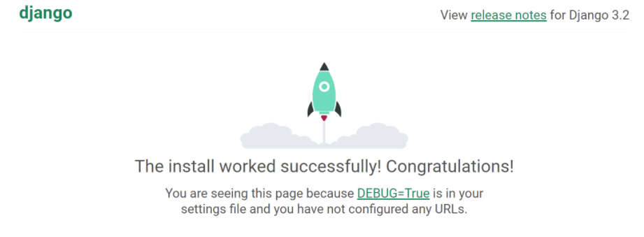

# Build a backend using Django (Python framework)

This project will teach you how to quickly build a backend for your web app using Django which is one of the most popular frameworks for backend development. Follow the steps and test it afterwards to see that it works properly. 

When you finish, you can use this project to customize it for your needs by creating your models, views (logic you want to apply on the backend with the info from your frontend), and API endpoints to communicate with your frontend.

If you want to learn different ways of setting your backend using Django, check out the references for more resources.

## Steps

1) Create a virtual environment and activate it.
2) Install Django by typing
pip install Django
Also install Django REST framework by typing
pip install djangorestframework
You need to create a Django project by typing
django-admin startproject NAME_OF_BACKEND_PROJECT
Choose the name that you like. For this project, the name is backend.
 
3) Start the server by navigating to the NAME_OF_BACKEND_PROJECT folder and type
python manage.py runserver
To check that the server is running properly, in a new tab in your browser go to
http://localhost:8000/
You should see a spaceship and say the installation worked successfully.

 
4) Migrate data to the db by navigating to your NAME_OF_BACKEND_PROJECT folder and typing
python manage.py migrate
Make sure you have the venv activated. You will see something like this:

Operations to perform:
  Apply all migrations: admin, auth, contenttypes, sessions
Running migrations:
  Applying contenttypes.0001_initial... OK
  Applying auth.0001_initial... OK
  Applying admin.0001_initial... OK
  Applying admin.0002_logentry_remove_auto_add... OK
  Applying admin.0003_logentry_add_action_flag_choices... OK
  Applying contenttypes.0002_remove_content_type_name... OK
  Applying auth.0002_alter_permission_name_max_length... OK
  Applying auth.0003_alter_user_email_max_length... OK
  Applying auth.0004_alter_user_username_opts... OK
  Applying auth.0005_alter_user_last_login_null... OK
  Applying auth.0006_require_contenttypes_0002... OK
  Applying auth.0007_alter_validators_add_error_messages... OK
  Applying auth.0008_alter_user_username_max_length... OK
  Applying auth.0009_alter_user_last_name_max_length... OK
  Applying auth.0010_alter_group_name_max_length... OK
  Applying auth.0011_update_proxy_permissions... OK
  Applying auth.0012_alter_user_first_name_max_length... OK
  Applying sessions.0001_initial... OK

Every time you want to migrate data to your database, you have to run that command.
The default db is SQLite but you can change that.

5) To create an API for your app, type
python manage.py startapp api
You need to create an admin user by typing
python manage.py createsuperuser
And you will need to input the username you want to create, an email, and a password.

6) Create a urls.py file in api folder and paste this (first image and then the code so you can copy paste).

from django.contrib.auth.models import User
from django.urls import path, include
from .views import ArticleViewSet, UserViewSet
from rest_framework.routers import DefaultRouter
 
router = DefaultRouter()
router.register('articles', ArticleViewSet, basename='articles')
router.register('users', UserViewSet)
 
urlpatterns = [
   path('api/', include(router.urls)),
]

7) Go to the urls.py file in the NAME_OF_PROJECT folder and delete what you have there and paste this that will add that new urls.py file from the previous step and also add authentication so only authorized users can call the api.

from django.contrib import admin
from django.urls import path, include
from rest_framework.authtoken.views import obtain_auth_token
 
urlpatterns = [
   path('admin/', admin.site.urls),
   path('', include('api.urls')),
   path('auth/', obtain_auth_token),
]

8) Go to models.py in api folder, delete what you have there, and create a model by pasting this

from django.db import models
 
class Article(models.Model):                    # you will create a table called Article
   title = models.CharField(max_length=100)    # ids are created automatically so you don't have to create an id
   description = models.TextField()
 
   def __str__(self):
       return self.title

9) Register the model created in admin.py in api folder by pasting

from django.contrib import admin
from .models import Article
 
@admin.register(Article)
class ArticleModel(admin.ModelAdmin):
   list_filter = ('title', 'description')          # add your filters
   list_display = ('title', 'description')

10) Create a serializers.py file in the api folder and paste this

from rest_framework import serializers
from .models import Article
from django.contrib.auth.models import User
from rest_framework.authtoken.views import Token
 
 
class ArticleSerializer(serializers.ModelSerializer):
   class Meta:
       model = Article
       fields = ['id', 'title', 'description']        # fields you want to retrieve from the api
 
class UserSerializer(serializers.ModelSerializer):
   class Meta:
       model = User
       fields = ['id', 'username', 'password']
 
       extra_kwargs = {'password':{
           'write_only': True,
           'required': True
       }}
 
   def create(self, validated_data):
       user = User.objects.create_user(**validated_data)
       Token.objects.create(user=user)
       return user

Comment: A model serializer is preferred over a serializer because it’s more succinct and clear to read. ModelSerializer will automatically generate a set of fields for you based on your model and validators for the serializer.

11) Go to settings.py in NAME_OF_PROJECT folder and add rest_framework, rest_framework.authtoken, and api under INSTALLED_APPS:

The rest_framekwork.authtoken is to prevent unauthorized users from creating/deleting/editing information in our backend.

12) Go to views.py in api folder and paste this

from django.shortcuts import render
from .models import Article
from .serializers import ArticleSerializer, UserSerializer
from rest_framework import viewsets
from rest_framework.permissions import AllowAny, IsAuthenticated
from rest_framework.authentication import TokenAuthentication
from django.contrib.auth.models import User
 
class ArticleViewSet(viewsets.ModelViewSet):
   queryset = Article.objects.all()
   serializer_class = ArticleSerializer
   permission_classes = [IsAuthenticated]
   authentication_classes = (TokenAuthentication, )
 
class UserViewSet(viewsets.ModelViewSet):
   queryset = User.objects.all()
   serializer_class = UserSerializer

13) Go to the folder where you have your backend folder project and type 
python manage.py makemigrations
You should see something like this
Migrations for 'api':
  api/migrations/0001_initial.py
    - Create model Article

Which states that the model Article was created successfully. 

14) To push it to the database, type
python manage.py migrate
And you will see something like this

15) If you go to the admin panel, you will see the model Articles created and the tokens for authentication:

Click on Tokens > Add token, select a user and click save. You will see a token created for that user. Therefore, only that user with that token will be able to see the viewset and interact with the model. 

16) Test that your new backend works correctly by using [Postman](https://www.postman.com/). 
Create a new workspace and put http://localhost:8000/api/users/ with a POST call and you should get a response with a 400 bad request error saying that username and password are required:

Go to Body in Postman, select form-data, and add username and password in KEY column and select a new username to be created and a password. You should get 201 created response with the new username created, without showing you the password value.

Now, go to your admin panel in localhost:8000 and go to Users to see the new user created.

Go to Tokens to see that a token has been created automatically for that new user.

Now, change the call to a GET and the url to http://localhost:8000/api/articles/ and you should get a 401 unauthorized error response because you didn’t provide credentials.

Go to Headers in Postman, add Authorization in KEY column and in VALUE column write Token and paste the token of the new user created. Now, you should be able to get the articles because you are using the credentials of an authorized user. You know it worked correctly if you get a 200 response.

You are all set! Customize it for your web app. Read the next section to have a better understanding of this framework.

## About Django's framework

The models.py file is where you will create the models to use in your backend. For example, if you have a sign-up for newsletters, you will need a model with the fields that the user completes when signing up. 

The admin.py file is to register each new model you create.

The serializers.py file is to create serializer functions for your new models.

The views.py file is to create the view of your new model. Don't forget to import the new serializer function you created for this model in the serializers.py file.

The urls.py file in the api folder is to register endpoints so front can send data to back, and viceversa. 

Don't forget to migrate the information after creating a new model by navigating to the folder that contains the manage.py file and type
python manage.py makemigrations
And then type
python manage.py migrate

## References

1) Video tutorial called [Django & ReactJS Full Stack Course [ Python Backend React Frontend ]](https://www.youtube.com/watch?v=VBqJ0-imSMU)
2) [Serializer documentation](https://www.django-rest-framework.org/tutorial/1-serialization/)

## Why do we need to create a virtual environment

The virtual environment is something you create when you start a project. It's always advisable to create a virtual environment for your new project so the libraries you install there don't conflict with your other projects that might demand other versions of the libraries. For example, I am using vaderSentiment version 3.3.2 for this project, but for another project, I might need vaderSentiment version 3.2.5.

To create a virtual environment in Python 3 and using VS Code as your IDE, write this in the terminal:
py -3 -m venv name_of_project
In my case, the name_of_project is demo_gh
Go to the folder that contains the virtual environment folder
And to activate the virtual environment type
name_of_project\Scripts\activate
You will see in parenthesis (name_of_project) before the path if you successfully activated the virtual environment.
If you are using shell, to activate the venv you type source name_of_project/bin/activate